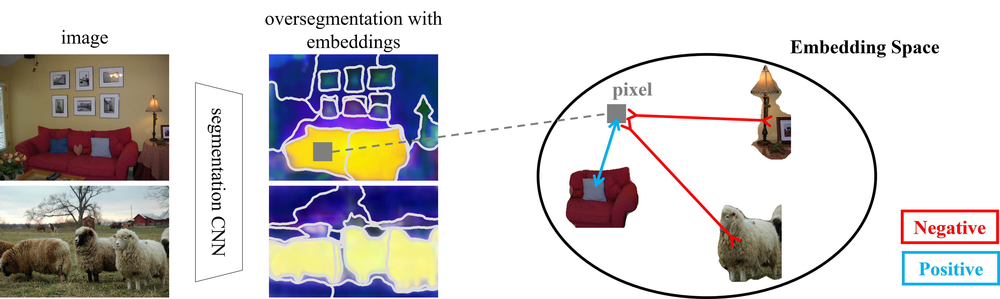

# Unsupervised Hierarchical Semantic Segmentation with Multiview Cosegmentation and Clustering Transformers
By [Tsung-Wei Ke](https://www1.icsi.berkeley.edu/~twke/), [Jyh-Jing Hwang](https://jyhjinghwang.github.io/), [Yunhui Guo](https://yunhuiguo.github.io/), [Xudong Wang](https://people.eecs.berkeley.edu/~xdwang/) and [Stella X. Yu](http://www1.icsi.berkeley.edu/~stellayu/)



Unsupervised semantic segmentation aims to discover groupings within and across images that capture object- and view-invariance of a category without external supervision.  Grouping naturally has levels of granularity, creating ambiguity in unsupervised segmentation.  Existing methods avoid this ambiguity and treat it as a factor outside modeling, whereas we embrace it and desire hierarchical grouping consistency for unsupervised segmentation.

We approach unsupervised segmentation as a pixel-wise feature learning problem.  Our idea is that a good representation must be able to reveal not just a particular level of grouping, but any level of grouping in a consistent and predictable manner across different levels of granularity.  We enforce spatial consistency of grouping and bootstrap feature learning with co-segmentation among multiple views of the same image, and enforce semantic consistency across the grouping hierarchy with clustering transformers.

We deliver the first data-driven unsupervised hierarchical semantic segmentation method called Hierarchical Segment Grouping (HSG). Capturing visual similarity and statistical co-occurrences, HSG also outperforms existing unsupervised segmentation methods by a large margin on five major object- and scene-centric benchmarks. 


## Code Base
This release of code is based on [SPML](https://github.com/twke18/SPML) in ICLR 2021.

## Prerequisites

1. Linux
2. Python3 (>=3.5)
3. Cuda >= 9.2 and Cudnn >= 7.6

## Required Python Packages

1. pytorch >= 1.6
2. numpy
3. scipy
4. tqdm
5. easydict == 1.9
6. PyYAML
7. PIL
8. opencv

## Data Preparation

### Pascal VOC 2012

1. Augmented Pascal VOC training set by [SBD](http://home.bharathh.info/pubs/codes/SBD/download.html). [Download link](https://github.com/jyhjinghwang/SegSort/blob/master/dataset/voc12/sbd_clsimg.zip) provided by [SegSort](https://github.com/jyhjinghwang/SegSort).
2. Ground-truth semantic segmentation masks are reformatted as grayscale images. [Download link](https://www.dropbox.com/sh/fd2m7s87gk7jeyh/AAC6tN6syhFKmEaDYCwUIgnXa?dl=0) provided by [SegSort](https://github.com/jyhjinghwang/SegSort).
3. Dataset layout:
```
   $DATAROOT/VOCdevkit/
       |-------- sbd/
       |          |-------- dataset/
       |                       |-------- clsimg/
       |
       |-------- VOC2012/
                  |-------- JPEGImages/
                  |-------- segcls/
```

### MSCOCO

1. Images from MSCOCO. Download 2017 Train Images ([here](https://cocodataset.org/#download)).
2. The over-segmentation masks are generated by combining contour detectors with gPb-owt-ucm. We use [Structured Edge (SE)](https://github.com/pdollar/edges) as edge detector.  You can download SE-owt-ucm masks [here](https://drive.google.com/file/d/1aiPVYaiFxgqN7Ih7s75t7aJFNjo6KIPf/view?usp=sharing) and put them under seginst/rf_0.25_48 folder.
3. Dataset layout:
```
   $DATAROOT/MSCOCO/
       |-------- images/
       |            |-------- train2017/
       |
       |-------- seginst/
                    |-------- rf_0.25_48/
                                   |-------- train2017/

```

### Cityscapes

1. Images from [Cityscapes](https://www.cityscapes-dataset.com/). Download `leftImg8bit_trainvaltest.zip`.
2. The over-segmentation masks are generated by combining contour detectors with gPb-owt-ucm. We use [Pointwise Mutual Information (PMI) edge detector](https://web.mit.edu/phillipi/pmi-boundaries/).  You can download PMI-owt-ucm masks [here](https://drive.google.com/file/d/1Zk017M_msWQctCm67G6bPmPGaZ_XyhJq/view?usp=sharing) and put them under seginst/ folder.
3. Ground-truth semantic segmentation masks are reformatted as grayscale images. Download [here](https://drive.google.com/file/d/1goJMo_yfXkH6i5CO7DRkOxpCtmxqoyh1/view?usp=sharing).
4. Dataset layout:
```
   $DATAROOT/MSCOCO/
       |-------- leftImg8bit/
       |              |-------- train/
       |              |-------- val/
       |
       |-------- gtFineId/
       |              |-------- train/
       |              |-------- val/
       |
       |-------- seginst/
                      |-------- pmi_0.05/

```


## MSCOCO Trained Models.
We provide the download links for our HSG models trained on MSCOCO and tested on PASCAL VOC.  All models are trained in two stage.  Larger batchsize (128/192) but smaller image size (224x224) is used in the first stage.  Smaller batchsize (48) but larger image size (448x448) is adopted in the second strage.  We summarize the performance as follows.

| Batch size  |      val (VOC)      |
| ------------- | ------------- |
| [128](https://drive.google.com/file/d/1GbhGjbCuQQyBTEU3O7smYpt5DanhLmOo/view?usp=sharing)  |     42.2      |
| [192](https://drive.google.com/file/d/1y2wvkg7zkHWx_SbPyntGfdaShjs7mZq5/view?usp=sharing)  |     43.7      |

## Cityscapes Trained Models.
We provide the download links for our HSG models trained and tested on Cityscaeps and tested on PASCAL VOC.  We only use finely-annotated images for training and testing (2975 and 500 images).  You can download our trained model [here](https://drive.google.com/file/d/1GBDvN4Y_0nbE4jWYcHUwBYiIktZI_fm3/view?usp=sharing), which achieves 32.4% mIoU on Cityscapes.

## Bashscripts to Get Started

* HSG on MSCOCO.
```
source bashscripts/coco/train.sh
```

* HSG on Cityscapes.
```
source bashscripts/cityscapes/train.sh
```

## Citation

If you find this code useful for your research, please consider citing our paper Universal Weakly Supervised Segmentation by Pixel-to-Segment Contrastive Learning.
```
@inproceedings{,
  title={Unsupervised Hierarchical Semantic Segmentation with Multiview Cosegmentation and Clustering Transformers},
  author={Ke, Tsung-Wei and Hwang, Jyh-Jing and Guo, Yunhui and Wang, Xudong and Yu, Stella X.},
  booktitle={Proceedings of the IEEE/CVF Conference on Computer Vision and Pattern Recognition},
  pages={},
  year={2022}
}
```

## License

SPML is released under the MIT License (refer to the LICENSE file for details).
